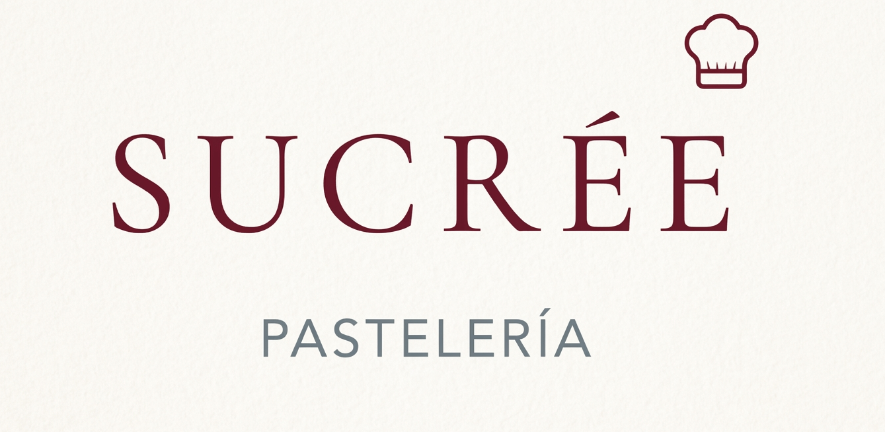

  

# 🎂 Sucrée Pastelería — Plataforma Web Boutique 👨‍🍳

Sitio web y catálogo interactivo diseñado para **Sucrée Pastelería**, un emprendimiento artesanal ubicado en Lobos, Buenos Aires, Argentina.

El proyecto combina un diseño sofisticado de estilo *boutique* con una arquitectura web ligera, enfocada en la conversión directa a WhatsApp y el posicionamiento local. Realizado en colaboración con la plataforma **[Lovable.dev](https://lovable.dev/)**.

🌐 **Demo en vivo:** [https://sucree-pasteleria.lovable.app/](https://sucree-pasteleria.lovable.app/)

---

## 🎨 Características Principales

- **Diseño Editorial & Boutique:** Paleta de colores cálidos (*Burgundy* & *Beige/Ivory*) adaptada a la identidad visual de la marca.
- **Catálogo Interactivo:** Animaciones de selección (*hover*) al explorar los productos del menú.
- **Conversión Directa:** Integración inmediata a WhatsApp para recepción de pedidos y consultas.
- **Estrategia Local:** Ficha de localización, horarios y conexión a mapa para potenciar el SEO local en Lobos.

---

## 🛠️ Tecnologías Utilizadas

- **Core:** React, TypeScript, Vite
- **Estilos:** Tailwind CSS, Lucide Icons, Shadcn UI
- **Despliegue & Sincronización:** Lovable + GitHub Workflow

---

## 🚀 Próximas Mejoras (Roadmap)

- [ ] Integración de fotografía gastronómica individual por producto.
- [ ] Módulo dinámico de promociones y combos de temporada.
- [ ] Carrito de compras automatizado con integración a Mercado Pago.

---

## 👩‍💻 Desarrollado por

**Noelia Orsini**  
*Programadora | Counselor | Abogada*  

🔗 [Perfil de LinkedIn](https://www.linkedin.com/in/noelia-orsini)
